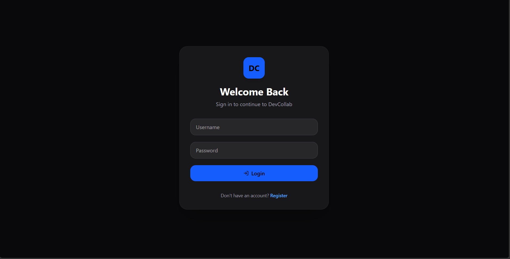
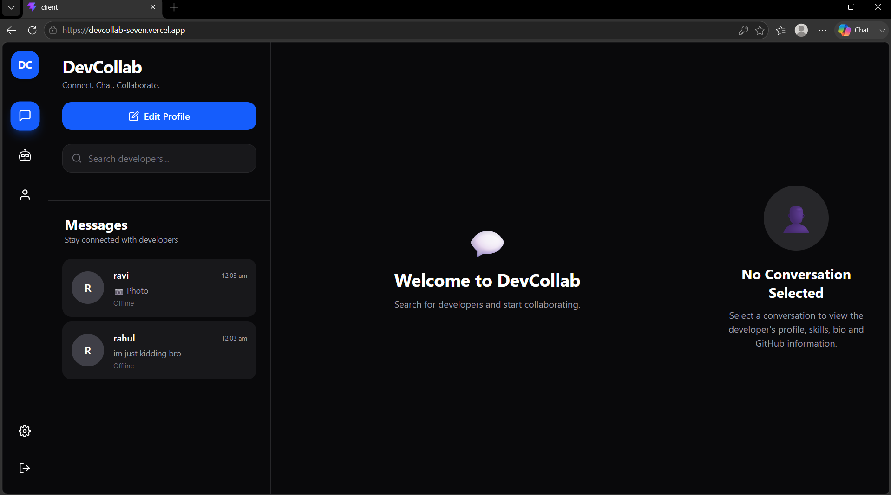
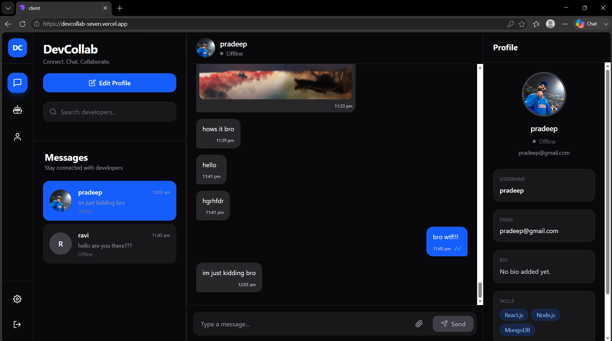
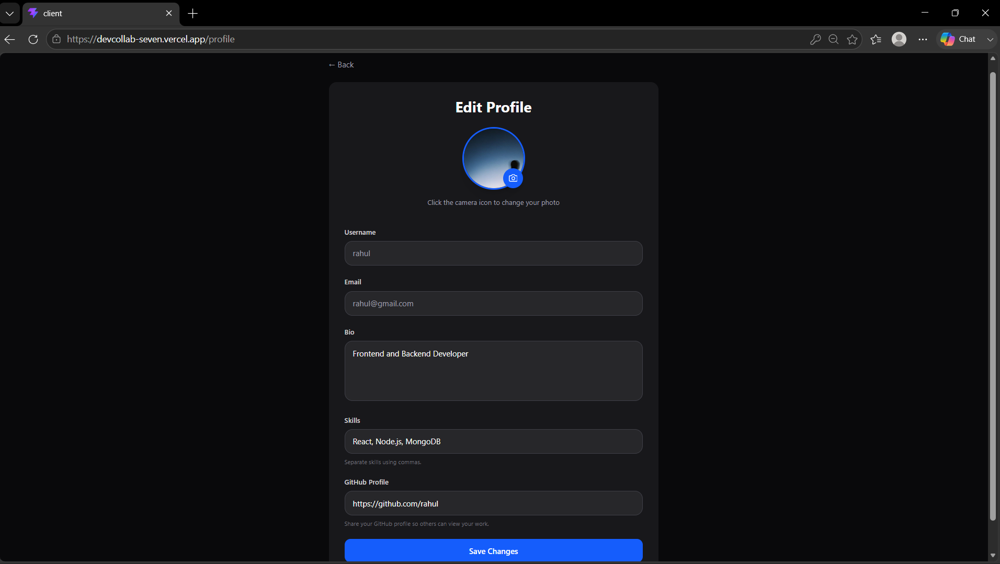

# 💬 DevCollab

A modern real-time developer collaboration platform built with the MERN stack, enabling developers to chat instantly, share images, manage professional profiles, and collaborate seamlessly.

---

## 🚀 Live Demo

### Frontend
https://devcollab-seven.vercel.app

### Backend API
https://devcollab-mm7w.onrender.com

---

## 📸 Screenshots

> Add screenshots here after deployment.

### Login Page


### dashboard



### Chats and Profile



### User Profile


---

# ✨ Features

## Authentication

- User Registration
- Secure Login
- JWT Authentication
- Protected Routes

---

## Real-Time Messaging

- One-to-One Chat
- Instant Messaging using Socket.IO
- Online / Offline Status
- Typing Indicator
- Seen Status
- Automatic Scroll to Latest Message

---

## Media Sharing

- Image Upload
- Cloudinary Integration
- Image Preview Modal

---

## Developer Profiles

Each user can maintain a professional profile including:

- Avatar
- Bio
- Skills
- GitHub Profile

---

## Responsive UI

- Mobile Friendly
- Desktop Optimized
- Responsive Sidebar
- Mobile Profile Drawer
- Independent Scroll Areas

---

# 🛠️ Tech Stack

## Frontend

- React
- React Router
- Tailwind CSS
- Axios
- Socket.IO Client
- React Hot Toast

---

## Backend

- Node.js
- Express.js
- MongoDB Atlas
- Mongoose
- JWT
- bcrypt
- Socket.IO
- Multer
- Cloudinary

---

# 📂 Project Structure

```
client/
│
├── src/
│   ├── api/
│   ├── components/
│   ├── context/
│   ├── hooks/
│   ├── pages/
│   ├── routes/
│   ├── services/
│   └── socket/
│
server/
│
├── config/
├── controllers/
├── middleware/
├── models/
├── routes/
├── socket/
├── helper/
└── server.js
```

---

# ⚙️ Installation

## Clone Repository

```bash
git clone https://github.com/pradeepkambalapally/devcollab.git

cd devcollab
```

---

## Backend Setup

```bash
cd server

npm install
```

Create a `.env`

```env
PORT=3000

MONGO_URL=YOUR_MONGODB_URI

JWT_SECRET=YOUR_SECRET

CLOUDINARY_CLOUD_NAME=YOUR_CLOUD_NAME

CLOUDINARY_API_KEY=YOUR_API_KEY

CLOUDINARY_API_SECRET=YOUR_API_SECRET
```

Run

```bash
npm run dev
```

---

## Frontend Setup

```bash
cd client

npm install
```

Create `.env`

```env
VITE_API_URL=http://localhost:3000/api

VITE_SOCKET_URL=http://localhost:3000
```

Run

```bash
npm run dev
```

---

# 🌐 Deployment

Frontend deployed on **Vercel**

Backend deployed on **Render**

Cloud Storage powered by **Cloudinary**

Database hosted on **MongoDB Atlas**

---

# 🎯 Future Improvements

- Group Chats
- Emoji Reactions
- File Sharing
- Message Search
- Push Notifications
- AI Assistant
- Dark / Light Theme
- User Presence ("Last Seen")

---

# 👨‍💻 Author

**Pradeep Kambalapally**

GitHub:
https://github.com/pradeepkambalapally

LinkedIn:
(https://www.linkedin.com/in/pradeep-kambalapally-a0b8a3307/)

---

# ⭐ Support

If you like this project, consider giving it a ⭐ on GitHub!